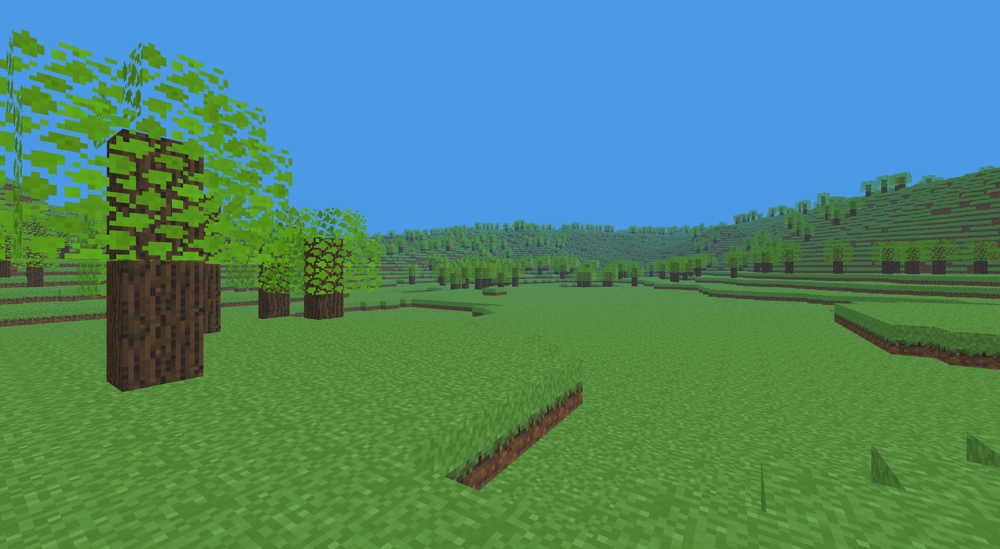

# Minecraft-Clone

A voxel based Minecraft clone written from scratch in C and OpenGL infinite, chunked terrain generation, occlusion culled meshing, multithreaded chunk streaming, and basic block interaction.

## Screenshots




## Download (prebuilt binary) 

Prebuilt Linux (x86_64) binaries are available on the Releases page no need to clone or build from source. 

    Download minecraft-clone-linux-x86_64.tar.gz from the latest release. 

    Extract and run: tar -xzvf minecraft-clone-linux-x86_64.tar.gzcd minecraft-clone-linux-x86_64./output 
     

You'll still need the dependencies listed below (glfw, glew, cglm, mesa) installed on your system the binary isn't statically linked. 

## Features

- Infinite terrain via deterministic coordinate seeded value noise
- Chunked world generation and rendering with occlusion hidden face culling
- Multithreaded chunk generation and streaming as the player moves
- Backface culling and distance fog
- Texture atlas based block rendering
- Block breaking and placing
- Wireframe debug view

## Controls

| Action | Key |
|---|---|
| Move | W A S D |
| Look | Mouse |
| Up / Down | E / Q |
| Break block | Right Click |
| Place block | Left Click |
| Select block | Scroll wheel |
| Toggle infinite world generation | Tab |
| Exit | Esc |

## Building

**Dependencies** \
Arch:
```
sudo pacman -S glfw-x11 glew cglm mesa
```

Debian / Ubuntu:
```
sudo apt update && sudo apt install libglfw3-dev libglew-dev libcglm-dev libgl1-mesa-dev
```

Fedora:
```
sudo dnf install glfw-devel glew-devel cglm-devel mesa-libGL-devel
```
Windows:
>Currently no Windows Support.

**Clone:**
```
git clone https://github.com/MasonAndrewHarrison/Minecraft-Clone.git
cd Minecraft-Clone
```

**Build & run:**
```
make
./output
```

## Third-party code

This project uses [stb_image.h](https://github.com/nothings/stb) by Sean Barrett for image loading, vendored under `textures/vendor/stb/`.

The block texture atlas (`textures/images/atlas.png`) is from [minecraft-weekend](https://github.com/jdah/minecraft-weekend) by jdah, used under the MIT License.

See [THIRD_PARTY_LICENSES.md](THIRD_PARTY_LICENSES.md) for full license text.
